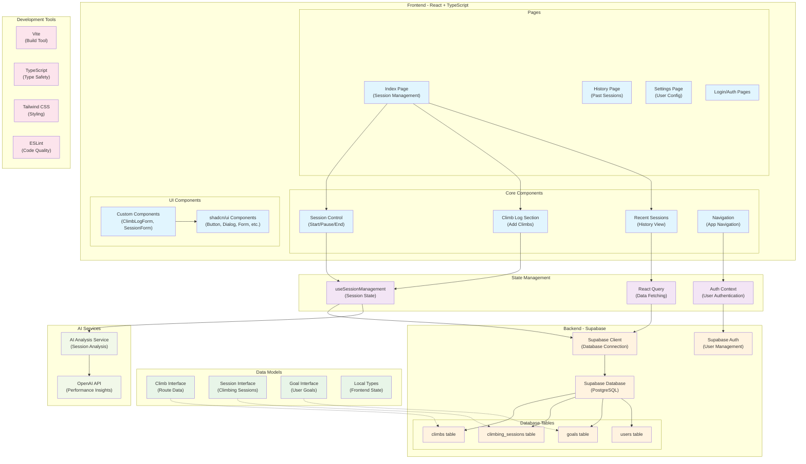

# Route Log Ascend Track - Codebase Architecture

This diagram explains the architecture and relationships within the climbing route logging and tracking application.

## Application Overview

This is a **climbing route logging and tracking application** built with modern React/TypeScript stack that helps climbers:
- Track climbing sessions in real-time
- Log individual climbs with detailed metrics (grade, type, attempts, etc.)
- Analyze performance with AI-powered insights
- Set and track climbing goals
- Review climbing history and progress

## Key Architecture Components

### Frontend Layer (Light Blue)
- **Pages**: Main application views (Session Management, History, Settings, Authentication)
- **Core Components**: Essential UI components for session control and climb logging
- **UI Components**: shadcn/ui component library + custom climbing-specific components

### State Management (Purple)
- **Auth Context**: Handles user authentication state
- **Session Hook**: Manages active climbing session state and logic
- **React Query**: Handles server state and data fetching/caching

### Data Models (Green)
- **Type Definitions**: TypeScript interfaces for Climb, Session, Goal, and local state types
- Ensures type safety throughout the application

### Backend - Supabase (Orange)
- **PostgreSQL Database**: Stores climbs, sessions, goals, and user data
- **Authentication**: User management and security
- **Client Integration**: Real-time database connection

### AI Services (Light Green)
- **Performance Analysis**: AI-powered insights on climbing sessions
- **OpenAI Integration**: Generates recommendations and progress analysis

### Development Tools (Pink)
- **Vite**: Fast build tool and dev server
- **TypeScript**: Type safety and developer experience
- **Tailwind CSS**: Utility-first styling
- **ESLint**: Code quality and consistency

The application follows modern React patterns with clean separation of concerns, making it maintainable and scalable for tracking climbing progress and performance analytics. 